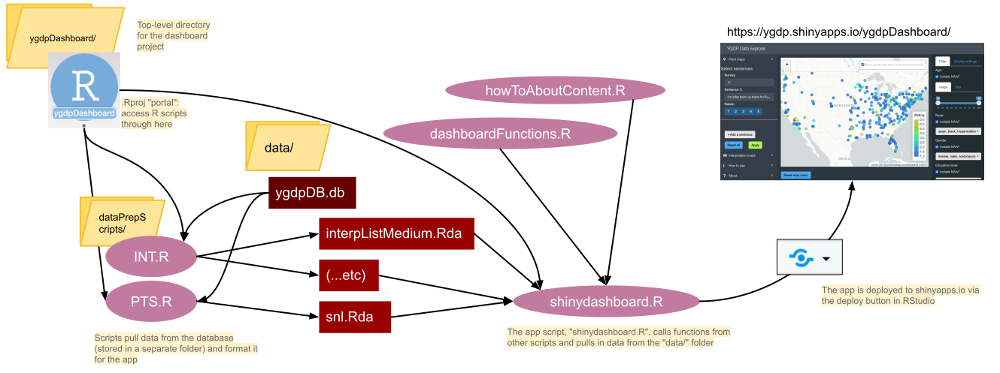

# README: ygdpDashboard

### Kaija Gahm

### 1/28/2021

**Last updated: `r Sys.Date()`**

```{r setup, include=FALSE}
knitr::opts_chunk$set(echo = TRUE)
library(fs)
```

README file for the YGDP Dashboard, developed in R Shiny.

### Files in this repo

This is a "tree" representation of the subfolders in this directory. The `.` at the top represents the top level directory (folder), called "ygdpDashboard". Note that this tree does not include all files in all the subdirectories.

```{r echo = F}
fs::dir_tree(recurse = 1)
```

-   **README.Rmd:** used to generate README.pdf.

-   **README.md** and **README.html**: README document for this repo; in different but equivalent formats.

-   **dashboardDataPipeline.svg:** graphic showing how the data moves through the prep scripts to create the database. Used in the README and in the tutorial video.

-   **dashboardFunctions.R**: supporting functions called by shinydashboard.R, used to create the app.

-   **data**/: directory containing the data that is used in the app.

-   **howTo/**: labeled images, which are used in the "How to use" app section.

-   **interpolations/**: data (hex rasters) used in the app's "Interpolation" mode.

-   **points/**: data (sentence ratings and demographic characteristics) used in the app's "Points" mode.

-   **dataPrepScripts/**: scripts used to generate the data contained in "data/interpolations/" and "data/points"

-   **INT.R**: script to generate hex rasters, contained in "data/interpolations/".

-   **PTS.R**: script to pull data from the database for points mode and clean it up. Results are stored in "data/points/".

-   **howToAboutContent.R**: static content for the "How to use" and "About" sections of the app. This script is sourced in "shinydashboard.R". I've just chosen to write the content in a separate R script in order to reduce clutter in the main app script. This is the script to edit if you want to add or change the information presented in the "How to use" and "About" sections.

-   **literature/**: some papers that describe analysis/viz methods relevant to the RGB mode of the app. May be relevant for future app development. See the RGB mode issue on GH.

-   **sketches/**: preliminary dashboard sketches, which I used to design the final product.

-   **ygdpDashboard.Rproj**: the .Rproj "portal" for accessing the R scripts in this directory. Open this first, and then use the "files" pane in RStudio to open other scripts. If you don't do this, the file paths won't work and your app won't run! For more information about this, see the README in the top-level directory, "kaijaFiles".

### `renv` for managing package versions

[`renv`](https://rstudio.github.io/renv/articles/renv.html) is an R package that manages **dependencies** (other R packages that are used by the code in the project). `renv` is useful for projects when they depend on functions from external packages that might change when those packages get updated.

Normally, when you use `install.packages()` to install an R package, the package gets installed onto your computer into folder called "library/". But that means you might run into trouble if you're working on one project that relies on, say, version 3.4.0 of a package, but then you have another project that will break unless you use an older version of that same package, version 3.3.0. It's hard to have two versions of the same package installed at the same time.

So, the "renv/" folder is a substitute for your computer's "library/" folder. When a project is using `renv`, the packages get installed into the "renv/" folder. This means that the project is *portable*! When you use the project on your computer through GitHub, you will automatically be using the right package versions, instead of having to update (or roll backward!) the package versions on your computer.

You won't have to interact with the "renv/" folder very much. If you install or update packages, you can save the new state of the repository by running `renv::snapshot()`. If you want to roll things back, you can use `renv::restore()`. For more details on using `renv`, see the guide [here](https://rstudio.github.io/renv/articles/renv.html).

### How to use this repo

1.  Make sure you have R and RStudio installed. For more information, see the README in "kaijaFiles".

2.  If you're reading this on GitHub and don't yet have this repository/folder downloaded, clone it into a new R project.

3.  Open the .Rproj file, "ygdpDashboard.Rproj".

4.  Use the "files" pane within RStudio to open "shinydashboard.R". Click "Run app" in the top right corner of the RStudio script pane.

### Code notes

*Here are some notes about the app code that you might find useful. As of 20 January 2021, these are also present as comments in the actual shinydashboard.R code, but I'm also putting them here in the README to make them more prominent and (hopefully) more permanent. Read these before you attempt to read through the code. I hope they'll be useful.*

1.  I use consistent acronyms in this script to help organize the code. (PTS) refers to "points mode" (i.e. the tab of the app that shows a map with points on it). (INT) refers to "interpolation mode". (HT) refers to the "How to use" tab. (AB) refers to the "About" tab.

2.  "XXX" is a marker I use when there is something in the code I want to come back to and fix. It's easy to find with Command + F in RStudio.

3.  Divider bars separate the sections of this code. RStudio automatically recognizes those as section breaks and uses them to create a very useful \*\*code outline\*\*. You can access it by clicking on the "Show document outline" button (a bunch of stacked horizontal lines) at the top righthand corner of the script panel in RStudio, or with the keyboard shortcut Shift + Command + O (on a Mac). This outline is where the (PTS), (INT), etc. abbreviations really come in handy.

4.  Common formatting abbreviations: \`br()\` inserts a line break. \`div()\` creates an html div, which can encompass other Shiny or html elements. \`hr()\` creates a horizontal rule/line to separate sections. \`a()\` creates a hyperlink. \`p()\` creates a paragraph of text.

5.  the 'ignoreInit = T' argument is used a lot in \`observeEvent()\` calls. This argument means that when the observer is first created, its handler expression (i.e. the code that says what to DO after observing the condition) does not run, regardless of whether the triggering condition is true. Prevents weird side effects and unnecessary slowdown on app load.

6.  In addition to the required \`label\` argument in inputs, which provides a unique identifier for that input, I have included the optional \`label\` argument in my \`reactiveValues\`, \`reactiveVal\`, \`reactive\`, \`observe\`, and \`observeEvent\` objects. This is primarily useful for visualizing the app's reactivity in the Shiny reactlog (<https://rstudio.github.io/reactlog/).> It also makes it easier to refer to parts of the code by name, e.g. in Github issues.

7.  There are some places in the app where I took hacky shortcuts that made things work but that might trip you up if you try to modify seemingly-basic things about the app. I apologize in advance! I was learning this as I went. I've marked places that I think fall into this category with \# AAA.

### How to add new data to the app

To update the data used by the app, use the two data preparation scripts, stored in the "dataPrepScripts/" folder. As you can probably guess, "PTS.R" prepares the data for the "points" mode in the app, and "INT.R" prepares the data for the "interpolation" mode in the app (see point 1 in "Code notes" above).

Each of these scripts pulls in data from the "ygdpDB.db" file, which is stored in a different project folder: "ygdpDB/database/currentDB/" (see the README documents in the "database/" folder for more information on the file structure over there)^[Note: if you're reading this on Github, you may or may not be authorized to make these changes to the app. The ygdpDB repo is private, and only authorized YGDP people can access it]. The scripts process the data and put it into a format that's usable by the app. The data output files are then stored here in the dashboard folder, under "data/" (in the respective subfolders for PTS and INT).

Finally, the "shinydashboard.R" script reads in the data files from "data/" and uses them to create the app.

If you've added additional data to the database, using the workflow outlined in the instructional document in "ygdpDB/database/", then you will need to copy the new version of the ygdpDB.db database over to this project and re-run the scripts in this pipeline in order to deploy a newly updated version of the app.

Here is a diagram that illustrates the pipeline I just described above. *Disclaimer:* this diagram does not include every file and every relationship between files. I'm just trying to give a general illustration of how the data gets analyzed by different scripts, and in what order. I hope it's helpful.



#### Acknowledgements

App created by Kaija Gahm in 2020-21. Debugging help and other input from Ian Neidel. Additional help from Jake Riley, Asmae Toumi, and Jonathan Trattner via the [R4ds Slack channel](https://www.rfordatasci.com/), as well as \@nirgrahamuk and \@ismirsehregal via [RStudio Community](https://community.rstudio.com/).
